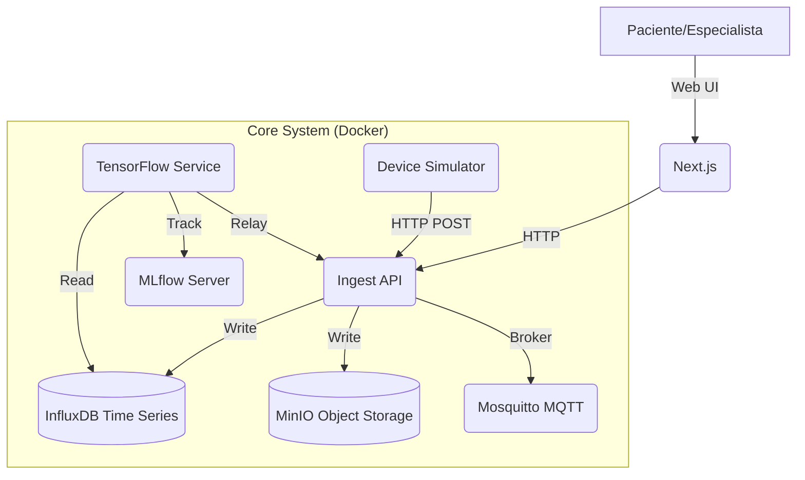

# Documentación Técnica del Proyecto E-NOSE

Este documento proporciona una visión técnica detallada de la arquitectura, tecnologías y flujo de datos del sistema de Nariz Electrónica (E-NOSE).

## 1. Visión General de la Arquitectura

El sistema está diseñado bajo una arquitectura de **Microservicios** contenerizados con Docker, comunicándose mediante protocolos HTTP (REST) y MQTT.

### Diagrama de Componentes


## 2. Stack Tecnológico

### Frontend (Interfaz de Usuario)
- **Framework:** Next.js 16 (App Router)
- **Lenguaje:** TypeScript
- **Estilos:** Tailwind CSS v4
- **Componentes UI:** Shadcn/ui (basado en Radix UI)
- **Gráficos:** Recharts (Visualización de datos de sensores)
- **Iconos:** Lucide React

### Backend (Microservicios)
#### 1. Ingest API (`services/ingest-api`)
- **Propósito:** Puerta de entrada de datos, validación y orquestación.
- **Tecnología:** Python (FastAPI)
- **Funciones Clave:**
  - Validación de esquemas (Pydantic).
  - Escritura en InfluxDB.
  - Comunicación con servicio de ML.

#### 2. ML Service (`services/ml-service`)
- **Propósito:** Análisis de patrones y detección de enfermedades.
- **Tecnología:** Python (FastAPI, TensorFlow, Pandas).
- **IA/Modelos:**
  - **Red Neuronal:** LSTM (Long Short-Term Memory) para series de tiempo.
  - **Framework:** TensorFlow / Keras 2.15.
  - **Detección Multi-Clase:** Sano, Diabetes (Acetona), Cáncer (Patrones complejos + NIR).

#### 3. Simulator (`simulator`)
- **Propósito:** Generación de datos sintéticos para pruebas y desarrollo.
- **Tecnología:** Python.
- **Capacidades:**
  - Simulación de sensores químicos (VOC, MQ3, MQ135).
  - Simulación de espectroscopía NIR.
  - Perfiles de pacientes configurables.

### Infraestructura de Datos
- **InfluxDB 2.7:** Base de datos de series temporales para lecturas de sensores de alta frecuencia.
- **MinIO:** Almacenamiento de objetos (S3 compatible) para datasets crudos y logs.
- **Eclipse Mosquitto:** Broker MQTT para comunicación IoT (opcional para sensores físicos).
- **MLflow:** Gestión del ciclo de vida de modelos de ML (Tracking de experimentos).

## 3. Estructura del Proyecto

```text
d:\E-NOSE\proyectoInterdisciplinario\
├── frontend/                # Aplicación Next.js
│   ├── src/app/             # Rutas y páginas
│   ├── components/          # Componentes React reutilizables
│   └── public/              # Assets estáticos
├── services/
│   ├── ingest-api/          # API de entrada de datos
│   └── ml-service/          # Servicio de Inteligencia Artificial
│       ├── models/          # Modelos entrenados (.keras)
│       ├── train_model.py   # Script de entrenamiento
│       └── predict.py       # Lógica de inferencia
├── simulator/               # Simulador de hardware E-NOSE
├── docker-compose.yml       # Orquestación de contenedores
├── LOGIC_AND_FORMULAS.md    # Documentación científica
└── README.md                # Guía de inicio rápido
```

## 4. Flujo de Datos (Data Flow)

1.  **Generación:** El `simulator` (o un dispositivo físico) genera un paquete JSON con lecturas de sensores cada segundo.
2.  **Ingesta:** Los datos se envían vía POST a `/ingest` en `ingest-api`.
3.  **Persistencia:** La API guarda inmediatamente los datos en `InfluxDB` para tener un registro histórico inmutable.
4.  **Inferencia (IA):**
    - La API envía el vector de características al `ml-service`.
    - El modelo LSTM o la lógica de respaldo analiza los patrones de VOC y NIR.
    - Se devuelve un diagnóstico probabilístico (ej. "Posible Diabetes").
5.  **Visualización:** El `frontend` consulta la API o lee de la base de datos para mostrar gráficos en tiempo real al especialista.
